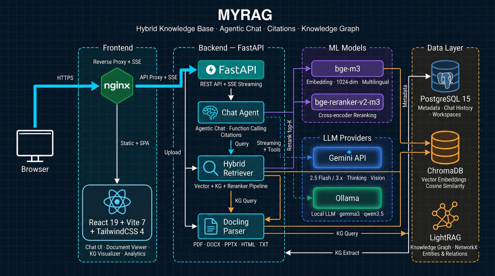
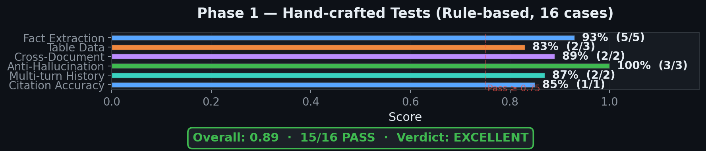
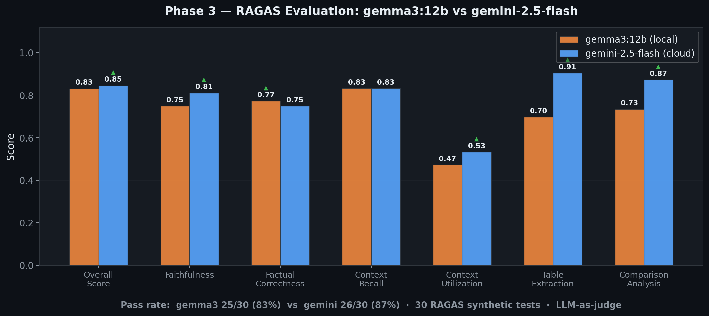

<div align="center">

# MYRAG

### 混合知识库：智能体对话、引用来源与知识图谱

[](https://python.org)
[](https://react.dev)
[](https://fastapi.tiangolo.com)
[](https://docker.com)

**上传文档。提出问题。获得带引用的答案。**

MYRAG 将向量检索、知识图谱与交叉编码器重排序整合成一条无缝的 RAG 流水线——由 Gemini、本地 Ollama 或完全离线的 sentence-transformers 驱动。

[功能特性](#功能特性) · [快速开始](#快速开始) · [模型推荐](#多提供商-llm) · [技术栈](#技术栈)

</div>

---

## 架构

<div align="center">



</div>

---

## 超越传统 RAG

大多数 RAG 系统遵循一条简单的流水线：切分文本 → 向量化 → 检索 → 生成。MYRAG 在每一个环节都走得更远：

| 方面 | 传统 RAG | MYRAG |
|---|---|---|
| **文档解析** | 纯文本提取，结构丢失 | Docling 或 [Marker](https://github.com/datalab-to/marker)：保留标题、页面边界、公式和版式——可通过配置切换 |
| **图片与表格** | 完全忽略 | 提取后由视觉 LLM 生成说明文字，并作为可检索的向量嵌入 |
| **切分** | 固定大小切分，可能切断句子 | 混合语义 + 结构切分（尊重标题、表格边界） |
| **向量化** | 所有内容使用单一模型 | 双模型：BAAI/bge-m3（1024 维，检索）+ KG 嵌入（Gemini 3072 维 / Ollama / sentence-transformers） |
| **检索** | 仅向量相似度 | 三路并行：向量超额召回 + KG 实体查找 + 交叉编码器重排序 |
| **知识** | 无实体感知 | LightRAG 图谱：实体抽取、关系映射、多跳遍历 |
| **上下文** | 原始分块直接丢给 LLM | 结构化组装：KG 洞见 → 带引用的分块 → 相关图片/表格 |
| **引用** | 无或手动 | 自动生成 4 字符 ID，附带页码与标题路径 |
| **页面感知** | 切分后丢失 | 端到端保留：分块 → 引用 → 文档查看器定位跳转 |

---

## 功能特性

<details>
<summary><b>深度文档解析（Docling / Marker）</b></summary>

MYRAG 支持两种文档解析器，可通过 `MYRAG_DOCUMENT_PARSER` 环境变量切换：

| 特性 | [Docling](https://github.com/docling-project/docling)（默认） | [Marker](https://github.com/datalab-to/marker) |
|---|---|---|
| **数学/公式** | 基础支持（存在已知 LaTeX 问题） | 通过 Surya 提供更优秀的 LaTeX 支持 |
| **GPU 占用** | 约 18-20GB 显存（启用公式增强时） | 约 2-4GB 显存 |
| **支持格式** | PDF、DOCX、PPTX、HTML | PDF、DOCX、PPTX、XLSX、HTML、EPUB |
| **切分** | HybridChunker（语义 + 结构） | 标题感知 + 基于页面 |
| **图片提取** | 通过 Docling 流水线 | 通过 Marker 流水线 |
| **表格提取** | 结构化导出 | Markdown 表格 |

两种解析器共享相同的输出契约（`ParsedDocument`）——无论选择哪种解析器，下游流水线（去重、向量化、KG、检索）的工作方式完全一致。

**两种解析器共有的功能：**
- **结构保留** —— 标题层级、页面边界、段落分组
- **多格式支持** —— PDF、DOCX、PPTX、TXT 输出一致
- **页面感知元数据** —— 每个分块都携带页码、标题路径以及同页图片/表格的引用
- **LLM 说明文字** —— 图片和表格由视觉/文本 LLM 生成说明，用于语义检索

```bash
# 在 .env 中切换解析器
MYRAG_DOCUMENT_PARSER=marker   # 或 "docling"（默认）
```

</details>

<details open>
<summary><b>混合检索流水线</b></summary>

| 阶段 | 技术 | 说明 |
|---|---|---|
| **向量嵌入** | BAAI/bge-m3 | 1024 维多语言双编码器（支持 100+ 种语言） |
| **KG 嵌入** | Gemini / Ollama / sentence-transformers | 可配置：Gemini（3072 维）、Ollama 或本地 sentence-transformers（例如 bge-m3 1024 维） |
| **向量检索** | ChromaDB | 余弦相似度，超额召回 top-20 候选 |
| **知识图谱** | LightRAG | 实体/关系抽取、关键词到实体的匹配 |
| **重排序** | BAAI/bge-reranker-v2-m3 | 交叉编码器联合打分——将（查询，分块）对一起编码 |
| **生成** | Gemini / Ollama | 支持函数调用的智能体流式对话 |

**为什么要用两个嵌入模型？** 向量检索需要速度（本地 bge-m3，1024 维）。知识图谱抽取需要语义丰富度以识别实体——可选择 Gemini Embedding（3072 维，云端）、Ollama 或 sentence-transformers（完全本地，无需 API）。每个模型都在自己的岗位上发挥最优性能。

**检索流程：**
1. **并行检索** —— 向量超额召回（top-20）与 KG 实体查找同时进行
2. **交叉编码器重排序** —— 全部 20 个候选通过 Transformer 与查询联合打分（比单纯余弦相似度精确得多）
3. **过滤** —— 保留相关性阈值（0.15）以上的 top-8；若全部低于阈值则回退到 top-3
4. **媒体发现** —— 找到检索分块所在页面的图片和表格

</details>

<details>
<summary><b>文档视觉智能</b></summary>

图片和表格会**嵌入到分块向量中**，而不是单独存储。当解析器提取到第 5 页的图片时，LLM 生成的说明文字会在向量化之前追加到该页的文本分块中。这意味着搜索"营收图表"时，会命中包含图表描述的分块，无需单独的图片检索索引。

**图片流水线**
1. 解析器（Docling 或 Marker）从 PDF/DOCX/PPTX 中提取图片（每个文档最多 50 张）
2. 视觉 LLM（Gemini Vision 或 Ollama 多模态）生成说明文字：具体数字、标签、趋势
3. 说明文字追加到页面分块：`[Image on page 5]: Graph showing 12% revenue growth YoY`
4. 分块被向量化 → **图片通过其描述成为可检索的向量**
5. 检索时，命中页面上的图片以 `[IMG-p4f2]` 引用形式呈现

**表格流水线**
1. 解析器将表格导出为结构化 Markdown（保留行、列、维度）
2. 文本 LLM 总结每个表格：用途、关键列、显著数值（最多 500 字符）
3. 总结追加到页面分块：`[Table on page 5 (3x4)]: Annual sales by region`
4. 表格总结以引用块形式注入回文档 Markdown，供文档查看器显示

</details>

<details>
<summary><b>自定义文档元数据</b></summary>

上传文档时附加自定义键值元数据，提升 RAG 准确度和组织能力：

- **元数据过滤** —— 执行混合搜索（语义 + 元数据过滤），缩小搜索范围并防止幻觉。
- **灵活组织** —— 无需单独的工作区，即可为文档打上 `year`、`category` 或 `author` 等属性标签。
- **优化检索** —— ChromaDB 中的预过滤可减少向量搜索的处理时间和延迟。
- **支持的接口** —— 在上传 API 中传入 `custom_metadata`（键值列表），在查询/对话 API 中传入 `metadata_filter`。

</details>

<details>
<summary><b>引用系统</b></summary>

每个答案都以**4 字符引用 ID**（例如 `[a3z1]`）锚定到源文档：

- **行内引用** —— 可直接点击的徽章，嵌入在答案文本中
- **来源卡片** —— 每条引用显示文件名、页码、标题路径和相关性分数
- **交叉导航** —— 点击引用即可跳转到文档查看器中的准确位置
- **图片引用** —— 视觉内容以 `[IMG-p4f2]` 形式单独引用，并带页面跟踪
- **严格锚定** —— LLM 被指示只引用直接支撑论断的来源，每个句子最多 3 条

</details>

<details>
<summary><b>知识图谱可视化</b></summary>

基于抽取出的实体和关系构建的交互式力导向图：

- **实体类型** —— 人物、组织、产品、地点、事件、技术、财务指标、日期、法规（可配置）
- **力学模拟** —— 斥力 + 弹簧力 + 中心引力，带实时物理
- **平移与缩放** —— 鼠标拖拽、滚轮（0.3x-3x）、键盘重置
- **节点交互** —— 点击选择、悬停高亮相连边、拖拽重排
- **实体缩放** —— 节点半径与连通度（度）成正比
- **查询模式** —— Naive、Local（多跳）、Global（摘要）、Hybrid（默认）
- **无需额外服务** —— LightRAG 使用基于文件的存储（NetworkX + NanoVectorDB），零 Docker 额外开销

</details>

<details open>
<summary><b>多提供商 LLM</b></summary>

通过单个环境变量在云端与本地模型之间切换：

#### Gemini（云端）

| 模型 | 最适合 | 思考模式 |
|---|---|---|
| `gemini-2.5-flash` | 通用对话、快速响应 | 基于预算（自动） |
| `gemini-3.1-flash-lite` | 高吞吐、高性价比 **推荐默认** | 基于级别：minimal / low / medium / high |

扩展思考会自动配置——Gemini 2.5 使用 `thinking_budget_tokens`，Gemini 3.x 使用 `thinking_level`。

#### Ollama（本地 / 自托管）

| 模型 | 参数量 | 工具调用 | 推荐程度 |
|---|---|---|---|
| `gemma4:e4b` | 45 亿有效参数（总 80 亿） | 原生 | **推荐默认** —— 性价比最高，128K 上下文，支持视觉 + 思考 + 原生工具调用 |
| `gemma4:e2b` | 23 亿有效参数（总 51 亿） | 原生 | 超轻量、响应快。可靠的工具调用需要开启思考 |
| `qwen3.5:9b` | 90 亿 | 原生 | 多语言支持好，工具调用可靠 |
| `qwen3.5:4b` | 40 亿 | 原生 | 轻量，可在 8GB 内存上运行。可能漏掉部分工具调用 |
| `gemma3:12b` | 120 亿 | 基于提示词 | 对旧版 Ollama，质量与速度平衡最好 |

> **提示**：Gemma 4 系列模型需要 **Ollama v0.20.0+**。MYRAG 会自动探测原生工具调用支持——支持的模型使用 Ollama 的原生工具 API（更可靠），其他模型自动回退到基于提示词的工具调用。

> **提示**：对于知识图谱抽取，更大的模型（12B+）能显著提升实体/关系质量。较小的模型（4B）在处理复杂文档时可能抽取到零实体。

**切换提供商** —— 注释/取消注释 `.env` 中的配置块：

```bash
# 云端（Gemini）
LLM_PROVIDER=gemini
GOOGLE_AI_API_KEY=your-key

# 本地（Ollama）—— 取消注释以切换
# LLM_PROVIDER=ollama
# OLLAMA_MODEL=gemma4:e4b
```

#### KG 嵌入提供商

知识图谱嵌入模型与对话 LLM 分开配置：

| 提供商 | 配置 | 是否需要 API | 维度 |
|---|---|---|---|
| **Gemini**（默认） | `KG_EMBEDDING_PROVIDER=gemini` | Google AI API 密钥 | 3072 |
| **Ollama** | `KG_EMBEDDING_PROVIDER=ollama` | Ollama 服务器 | 视模型而定 |
| **sentence-transformers** | `KG_EMBEDDING_PROVIDER=sentence_transformers` | 无需（完全本地） | 视模型而定（例如 bge-m3 为 1024） |

```bash
# 完全本地的 KG 嵌入——无需 API 或外部服务
KG_EMBEDDING_PROVIDER=sentence_transformers
KG_EMBEDDING_MODEL=BAAI/bge-m3
KG_EMBEDDING_DIMENSION=1024
```

> **提示**：`sentence_transformers` 会复用向量检索已经下载的同一个 `BAAI/bge-m3` 模型——零额外磁盘占用、零 API 费用、完全离线。

</details>

<details>
<summary><b>智能体流式对话</b></summary>

对话系统采用半智能体架构，并通过 SSE 实时流式输出：

- **智能体步骤** —— 可视化时间线：分析中 → 检索中 → 生成中 → 完成（带实时计时）
- **扩展思考** —— Gemini/Ollama 的推理过程显示在可折叠面板中
- **函数调用** —— 三层机制：原生（Gemini）、原生（Ollama——Gemma 4、Qwen 3.5）或基于提示词的回退（旧模型）。通过探测自动检测
- **强制搜索模式** —— 在 LLM 生成前预检索，确保答案有据可依
- **心跳保活** —— 15 秒 SSE 心跳防止慢响应时 TCP 超时
- **回退机制** —— 若 Ollama 产生空输出，自动触发搜索并重试
- **聊天记录** —— 每个工作区持久保存，支持消息评分（赞/踩）

</details>

<details>
<summary><b>UI / UX</b></summary>

**主题与布局**
- 深色 / 浅色模式平滑切换，偏好持久保存
- 可折叠侧边栏，支持工作区导航（窄屏时仅显示图标）
- 响应式网格布局——从移动端到桌面端

**对话界面**
- 流式 token 渲染，带记忆化的段落块（只重渲染活动块）
- 行内引用徽章，悬停显示工具提示（源文件、页码、标题路径、相关度百分比）
- 智能体步骤时间线，带加载动画和耗时计时
- 思考面板——可滚动、自动跟随、完成后可折叠
- 代码块支持语法高亮（Python、JS、SQL 等）和一键复制

**文档管理**
- 拖拽上传（PDF、DOCX、PPTX、TXT、MD——最大 50MB）
- 处理中的状态徽章带微光动画
- 每个文档的标签：页数、分块数、图片数、表格数、文件大小、处理耗时

**搜索**
- 4 种查询模式：Hybrid、Vector、Local KG、Global KG
- 可调结果数量（1-20），支持滑块 + 直接输入
- 文档范围过滤（多选）
- 相关性分数条，颜色分级（绿 / 琥珀 / 红）

**分析仪表盘**
- 统计卡片：文档、已索引、分块、图片、实体、关系
- 实体类型分布条形图，带宽度动画
- 按连通度排名的主要实体
- 每个文档的分块分布图

**微交互**
- 全程使用 Framer Motion 动画（交错入场、布局过渡）
- 加载骨架屏、Toast 通知、空状态插图
- 键盘快捷键：`/` 聚焦搜索，`Enter` 发送，`Escape` 取消

</details>

<details>
<summary><b>工作区系统</b></summary>

- 多个相互隔离的知识库，各自拥有独立的文档、ChromaDB 集合和 KG
- 每个工作区可配置自定义系统提示词（覆盖默认问答行为）
- 独立的聊天记录，支持消息持久化与评分

</details>

---

## 评估

MYRAG 使用两种互补方法进行了评估：**16 项手工测试**（基于规则的指标）和 **30 项 RAGAS 合成测试**（LLM 作为裁判）。测试语料：TechVina 2025 年年度报告（越南语，26 个分块）+ DeepSeek-V3.2 技术论文（英语，57 个分块）。

<details open>
<summary><b>阶段一 —— 手工测试（基于规则）</b></summary>

<div align="center">



</div>

覆盖 6 个类别的 16 项测试，使用 8 种基于规则的指标（关键词覆盖率、拒答准确率、引用格式、语言匹配等）——不涉及 LLM 裁判。

| 类别 | 通过率 | 平均分 |
|---|---|---|
| 事实抽取（越南语 + 英语） | 5/5 | 0.93 |
| 表格数据 | 2/3 | 0.83 |
| 跨文档推理 | 2/2 | 0.89 |
| 防幻觉 | 3/3 | 1.00 |
| 多轮历史 | 2/2 | 0.87 |
| 引用准确率 | 1/1 | 0.85 |
| **总计** | **15/16** | **0.89 —— 优秀** |

</details>

<details open>
<summary><b>阶段三 —— RAGAS 合成测试（LLM 裁判）</b></summary>

<div align="center">



</div>

30 对自动生成的问答，由 Gemini 2.0 Flash 作为 RAGAS 裁判评估。同一组问题在两种模型上测试：

| 指标 | gemma3:12b（本地） | gemini-2.5-flash（云端） | 胜者 |
|---|---|---|---|
| **综合得分** | 0.832 | **0.846** | Gemini |
| **通过率** | 25/30（83%） | **26/30（87%）** | Gemini |
| 忠实度 | 0.749 | **0.812** | Gemini（+0.063） |
| 事实正确性 | **0.773** | 0.749 | gemma3（+0.024） |
| 上下文召回 | 0.833 | 0.833 | 平手 |
| 表格抽取 | 0.697 | **0.905** | Gemini（+0.208） |
| 平均延迟 | **3076ms** | 3283ms | gemma3（-207ms） |

</details>

<details>
<summary><b>优势与已知局限</b></summary>

| 方面 | 状态 | 详情 |
|---|---|---|
| 防幻觉 | :green_circle: 强 | 对超范围问题完美拒答 |
| 引用格式 | :green_circle: 强 | 所有测试中格式 100% 正确 |
| 跨文档推理 | :green_circle: 强 | 能成功综合多个来源 |
| 表格解析 | :yellow_circle: 依赖模型 | gemma3 处理复杂表格失败；Gemini 表现良好 |
| 语言一致性 | :yellow_circle: 依赖模型 | gemma3 偶尔以错误语言作答 |
| 检索覆盖 | :red_circle: 弱 | 5 个案例 context_recall = 0（检索遗漏了特定事实） |
| 忠实度 | :red_circle: 弱 | 4 个 FAIL 案例——LLM 在展开回答时添加了无依据的细节 |

> 完整评估方法与逐样本结果：[`rag_evaluation_report.md`](showcase/rag_evaluation_report.md)

</details>

<details>
<summary><b>计划中的评估</b></summary>

即将在同一套 30 项 RAGAS 测试上进行的模型基准测试：

| 模型 | 类型 | 状态 |
|---|---|---|
| gemma3:12b | 本地（Ollama） | :white_check_mark: 已完成 |
| gemini-2.5-flash | 云端（Google AI） | :white_check_mark: 已完成 |
| qwen3.5:4b | 本地（Ollama） | :hourglass: 计划中 |
| qwen3.5:9b | 本地（Ollama） | :hourglass: 计划中 |
| gemini-3.1-flash-lite | 云端（Google AI） | :hourglass: 计划中 |

目标：在忠实度、表格抽取和多语言一致性方面，对比本地 4B/9B 模型的成本效益与云端模型的质量。

</details>

---

## 技术栈

<details>
<summary><b>后端</b></summary>

| 技术 | 用途 |
|---|---|
| **FastAPI** | 异步 Web 框架，支持 SSE 流式输出 |
| **SQLAlchemy 2.0** | 异步 ORM，配合 PostgreSQL（asyncpg） |
| **ChromaDB** | 向量存储——余弦相似度、按工作区隔离的集合 |
| **LightRAG** | 知识图谱——实体抽取、多跳查询 |
| **Docling / Marker** | 文档解析——PDF、DOCX、PPTX、HTML 的结构化抽取（可通过配置切换） |
| **sentence-transformers** | BAAI/bge-m3 嵌入 + BAAI/bge-reranker-v2-m3 重排序 |
| **google-genai** | Gemini API——对话、视觉、函数调用、扩展思考 |
| **ollama** | 本地 LLM——通过提示词标签调用工具、多模态支持 |

</details>

<details>
<summary><b>前端</b></summary>

| 技术 | 用途 |
|---|---|
| **React 19** + **TypeScript 5.9** | UI 框架，严格类型检查 |
| **Vite 7** | 开发服务器与生产打包器 |
| **TailwindCSS 4** | 工具类优先的样式，支持深色 / 浅色主题 |
| **Zustand 5** | 轻量状态管理 |
| **React Query 5** | 异步数据获取、缓存与变更 |
| **Framer Motion 12** | 布局动画、过渡、交错入场 |
| **react-markdown** + **KaTeX** | 富 Markdown 与 LaTeX 数学公式渲染 |
| **Lucide React** | 图标库 |

</details>

<details>
<summary><b>基础设施</b></summary>

| 技术 | 用途 |
|---|---|
| **PostgreSQL 15** | 文档元数据、聊天记录、工作区配置 |
| **ChromaDB** | 向量嵌入（HTTP 客户端，容器化） |
| **LightRAG** | 基于文件的 KG（NetworkX + NanoVectorDB——无需额外服务） |
| **Docker Compose** | 全栈部署（4 个容器） |
| **nginx** | 生产环境前端托管 + API/SSE 反向代理 |

</details>

---

## 快速开始

### 方式 A：Docker（全栈）

```bash
git clone https://github.com/shajinhui/MYRAG.git
cd MYRAG
cp .env.example .env
# 编辑 .env —— 设置 GOOGLE_AI_API_KEY（或切换到 Ollama）
docker compose up -d
```

首次构建约需 5-10 分钟（下载约 2.5GB 的 ML 模型）。打开 http://localhost:5174

### 方式 B：本地开发

```bash
git clone https://github.com/shajinhui/MYRAG.git
cd MYRAG
./setup.sh
```

该脚本会检查前置条件、创建 venv、安装依赖、启动 PostgreSQL 和 ChromaDB，并按需下载 ML 模型。

```bash
# 终端 1 —— 后端（端口 8080）
./run_bk.sh

# 终端 2 —— 前端（端口 5174）
./run_fe.sh
```

打开 http://localhost:5174

<details>
<summary><b>系统要求</b></summary>

| 资源 | 最低要求 | 推荐配置 |
|---|---|---|
| 内存 | 4 GB | 8 GB 以上 |
| 磁盘 | 5 GB | 10 GB 以上 |
| Python | 3.10+ | 3.11+ |
| Node.js | 18+ | 22 LTS |
| Docker | 20+ | 最新版 |

</details>

---

<details>
<summary><h2>配置</h2></summary>

复制 `.env.example` 并进行配置：

```bash
cp .env.example .env
```

### 必需项

| 变量 | 说明 |
|---|---|
| `GOOGLE_AI_API_KEY` | Google AI API 密钥（使用 Gemini 提供商时必须） |

### LLM

| 变量 | 默认值 | 说明 |
|---|---|---|
| `LLM_PROVIDER` | `gemini` | `gemini` 或 `ollama` |
| `LLM_MODEL_FAST` | `gemini-2.5-flash` | 用于对话和 KG 抽取的模型 |
| `LLM_THINKING_LEVEL` | `medium` | Gemini 3.x 思考级别：`minimal` / `low` / `medium` / `high` |
| `LLM_MAX_OUTPUT_TOKENS` | `8192` | 最大输出 token 数（含思考过程） |
| `OLLAMA_HOST` | `http://localhost:11434` | Ollama 服务器地址 |
| `OLLAMA_MODEL` | `gemma3:12b` | Ollama 模型名称 |

### KG 嵌入

| 变量 | 默认值 | 说明 |
|---|---|---|
| `KG_EMBEDDING_PROVIDER` | `gemini` | `gemini`、`ollama` 或 `sentence_transformers` |
| `KG_EMBEDDING_MODEL` | `text-embedding-004` | 模型名称（取决于提供商） |
| `KG_EMBEDDING_DIMENSION` | `3072` | 嵌入维度（必须与模型匹配） |

### RAG 流水线

| 变量 | 默认值 | 说明 |
|---|---|---|
| `MYRAG_EMBEDDING_MODEL` | `BAAI/bge-m3` | 嵌入模型（1024 维） |
| `MYRAG_RERANKER_MODEL` | `BAAI/bge-reranker-v2-m3` | 交叉编码器重排序模型 |
| `MYRAG_VECTOR_PREFETCH` | `20` | 重排序前的候选数量 |
| `MYRAG_RERANKER_TOP_K` | `8` | 重排序后的最终结果数 |
| `MYRAG_ENABLE_KG` | `true` | 启用知识图谱抽取 |
| `MYRAG_DOCUMENT_PARSER` | `docling` | 文档解析器：`docling`（默认）或 `marker`（更轻量、数学更好） |
| `MYRAG_MARKER_USE_LLM` | `false` | 为 Marker 启用 LLM 增强模式（更好的表格与公式） |
| `MYRAG_ENABLE_IMAGE_EXTRACTION` | `true` | 从文档中提取图片 |
| `MYRAG_ENABLE_IMAGE_CAPTIONING` | `true` | 使用 LLM 为图片生成说明文字以支持检索 |
| `MYRAG_KG_LANGUAGE` | `Vietnamese` | KG 抽取语言 |

</details>

---

## 路线图

- [ ] **多模态检索** —— 集成 Gemini Embedding 2（多模态），支持音频和视频输入检索——直接对播客、讲座或视频内容提问
- [x] **Marker PDF 解析器** —— 新增 [Marker](https://github.com/datalab-to/marker) 作为备选文档解析器，数学/公式抽取更优（通过 Surya 生成 LaTeX），GPU 占用更低（约 2-4GB 显存，对比 Docling 的约 18-20GB），可通过 `MYRAG_DOCUMENT_PARSER=marker` 环境变量切换

---

## MCP 服务器

MYRAG 内置一个 [Model Context Protocol (MCP)](https://modelcontextprotocol.io/) 服务器，暴露其核心功能：
- `get_workspace_list`：列出所有知识库。
- `get_document_by_id`：获取指定文档的详细信息。
- `query`：使用语义检索查询已索引的文档。

### 连接 MCP 服务器

MCP 服务器默认随 `docker-compose up -d` 自动启动，监听端口 `8000`，使用 Streamable HTTP 传输（最新协议版本）。

#### Cursor / Claude Desktop

你可以直接将 MYRAG MCP 服务器以 SSE 连接的方式添加到 Cursor 或 Claude，使用以下 URL：
`http://localhost:8000/mcp`
*（注意：部分客户端仍将其标记为 SSE 连接，但应使用 `/mcp` 端点通过 Streamable HTTP 连接。）*

---

## API

所有端点均以 `/api/v1` 为前缀。交互式文档位于 http://localhost:8080/docs

<details>
<summary><b>工作区</b></summary>

| 方法 | 端点 | 说明 |
|---|---|---|
| `GET` | `/workspaces` | 列出所有工作区 |
| `POST` | `/workspaces` | 创建工作区 |
| `PUT` | `/workspaces/{id}` | 更新工作区 |
| `DELETE` | `/workspaces/{id}` | 删除工作区及其全部数据 |

</details>

<details>
<summary><b>文档</b></summary>

| 方法 | 端点 | 说明 |
|---|---|---|
| `POST` | `/documents/upload/{workspace_id}` | 上传文件（支持 `custom_metadata`） |
| `GET` | `/documents/{id}/markdown` | 获取解析后的内容 |
| `GET` | `/documents/{id}/images` | 列出提取出的图片 |
| `DELETE` | `/documents/{id}` | 删除文档 |

</details>

<details>
<summary><b>RAG —— 搜索、对话、分析</b></summary>

| 方法 | 端点 | 说明 |
|---|---|---|
| `POST` | `/rag/query/{workspace_id}` | 混合搜索（支持 `metadata_filter`） |
| `POST` | `/rag/chat/{workspace_id}/stream` | 智能体流式对话（SSE）（支持 `metadata_filter`） |
| `GET` | `/rag/chat/{workspace_id}/history` | 聊天记录 |
| `POST` | `/rag/process/{document_id}` | 处理文档 |
| `GET` | `/rag/graph/{workspace_id}` | 知识图谱数据 |
| `GET` | `/rag/analytics/{workspace_id}` | 完整分析数据 |

</details>
